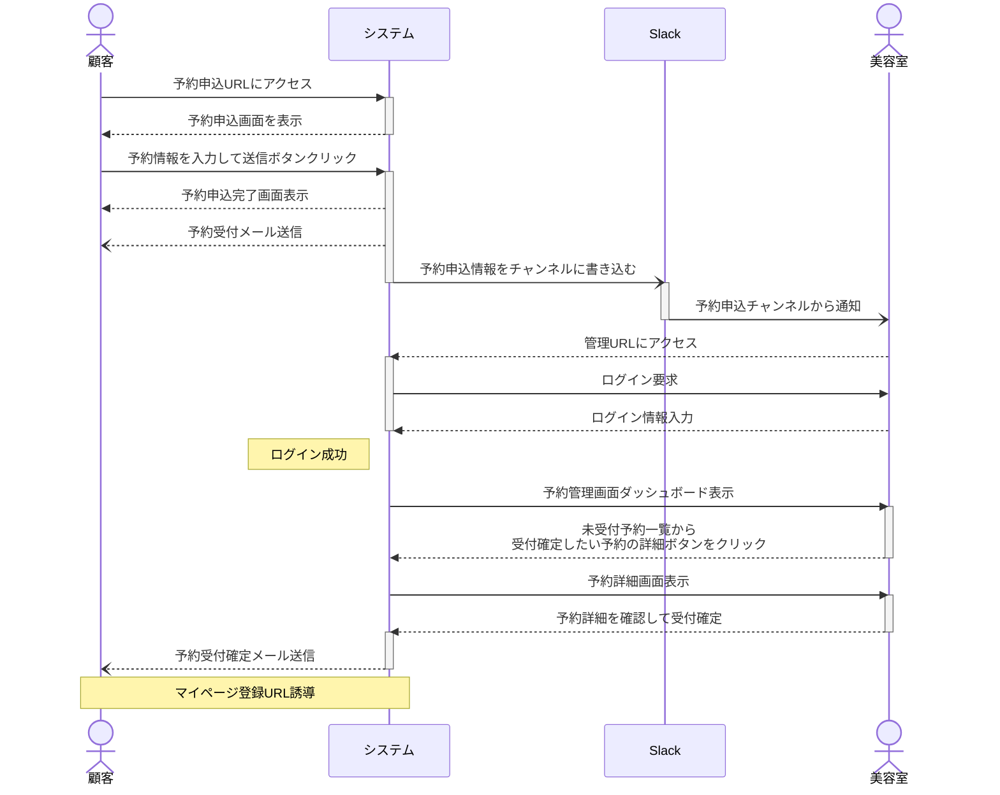
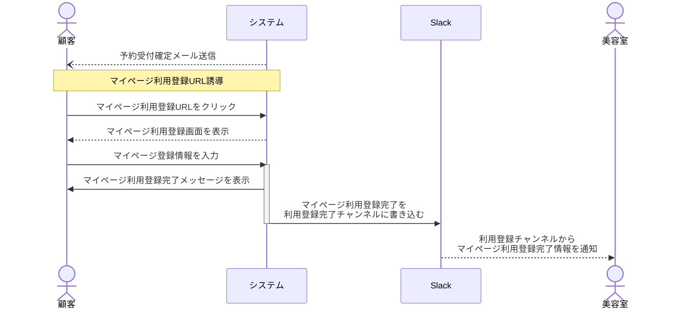
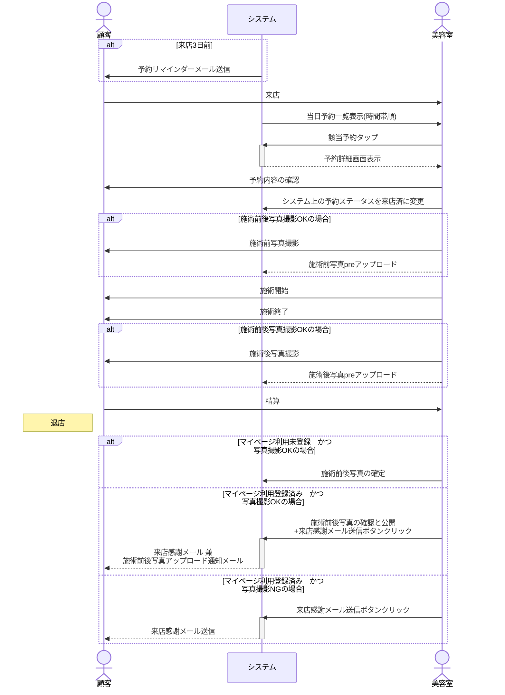

# Laravelポートフォリオ 美容室予約管理システム

## 要求分析（要件定義）
### [要求分析書（要件定義書）](/docs/要件定義書.md)

## 基本設計（外部設計）	
### 業務フロー
#### 新規顧客予約申込

#### マイページ利用登録フロー

#### 顧客来店～退店までのフロー

### システム構成図
### ER図
### テーブル定義書
### 機能一覧表
### 設計書記述様式
### 基本設計書（外部設計書）	
#### 概要
#### I/O関連図
#### 画面／帳票レイアウト

## 詳細設計（内部設計）
### 画面遷移図
### 詳細設計書（内部設計書）	
#### 概要
#### I/O関連図
#### 画面／帳票レイアウト
#### 項目説明書
#### 更新仕様書
#### 補足説明
### API設計書
### プロジェクト共通ルール

## 単体テスト
### 単体テスト仕様書／報告書
## 結合テスト
### 結合テスト仕様書／報告書
## 総合テスト
### 総合テスト仕様書／報告書

## リリース